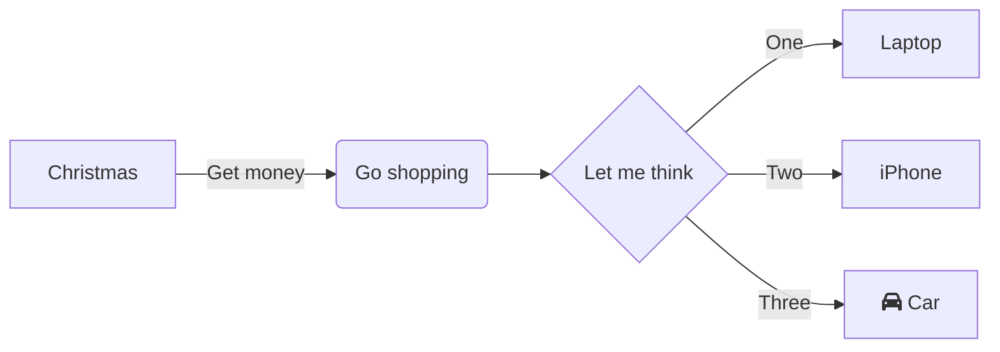

# Module quick

[comment]: <> (// DONE:4 Add description for this module)

## Description

This adds a custom module-level description for the app module.

## Flowchart

# Package com.sample.android.quickapp.sample

This is the only package in the sample app.
It demonstrate usages of `quickapp:core` and `quickapp:utilities`

## Level 2 heading

Everything is rendered as plain markdown and gets associated with the first level heading
(Module or Package).
